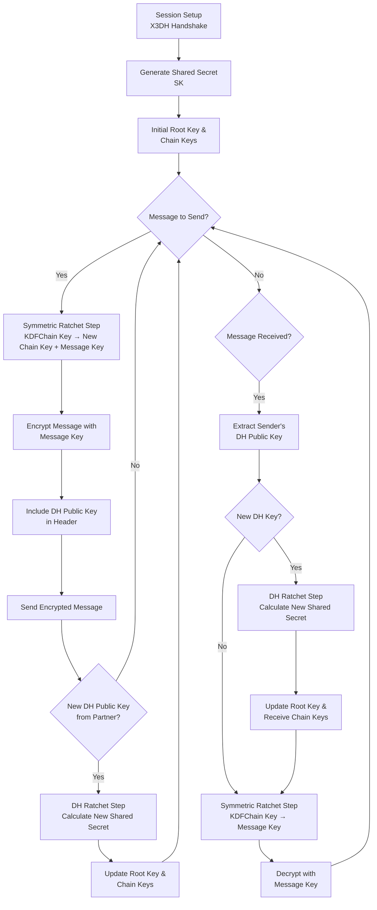

# Double Ratchet Algorithm: Complete Guide with WhatsApp Example

## Core Concept in Simple Terms

Imagine you and a friend are sending secret messages. You want **three main things**:

1. **Confidentiality**: No one else can read them
2. **Integrity**: No one can change them in transit  
3. **Forward Secrecy**: If an attacker steals your phone today, they **cannot** decrypt your past conversations

The Double Ratchet provides all of this, automatically and seamlessly. The name comes from two mechanisms that "ratchet" forward, making it impossible to go backwards.

---

## The Two Ratchets

### 1. Diffie-Hellman (DH) Ratchet
**"The Asymmetric Ratchet"**
- Changes long-term secrets periodically
- Each party generates new DH key pairs and exchanges public keys
- Provides **post-compromise security**
- Like changing the core lock on your secret vault

### 2. Symmetric Key Ratchet  
**"The Chaining Ratchet"**
- Generates new message key for every single message
- Works like a hash chain - takes current state and "hashes" forward
- Provides **per-message forward secrecy**
- Fast and efficient

---

## Flowchart: Double Ratchet Algorithm



---

## Complete Flow: Step-by-Step

### Phase 1: Initial Handshake (Session Setup)

**Before first message:**
```python
# This happens automatically when you see
# "Chat is secured with end-to-end encryption"
Alice & Bob perform X3DH handshake → Shared Secret (SK)
```

### Phase 2: Ongoing Conversation

#### **Message 1: Alice → Bob** ("Hey Bob!")

**Alice's Side (Sending):**
```python
# 1. Symmetric Ratchet Step
New_Chain_Key, Message_Key = KDF(Current_Chain_Key)

# 2. Encryption
Ciphertext = Encrypt("Hey Bob!", Message_Key)

# 3. Send
Send(Ciphertext + Alice_DH_Public_Key)
```

**Bob's Side (Receiving):**
```python
# 1. Receive & Detect New DH Key
if received_new_DH_key:
    # 2. DH Ratchet Step
    New_Root_Key, New_Chain_Key = KDF(DH(Alice_Public_Key, Bob_Private_Key))
    
# 3. Symmetric Ratchet Step  
Regenerated_Message_Key = KDF(Current_Chain_Key)

# 4. Decryption
Plaintext = Decrypt(Ciphertext, Regenerated_Message_Key)
# "Hey Bob!" ✓
```

#### **Message 2: Bob → Alice** ("Hi Alice!")

**Bob's Side (Sending):**
```python
# Generate new DH key pair
New_Bob_DH_Private, New_Bob_DH_Public = Generate_DH_KeyPair()

# Symmetric Ratchet + Encryption
New_Chain_Key, Message_Key = KDF(Current_Chain_Key)
Ciphertext = Encrypt("Hi Alice!", Message_Key)

Send(Ciphertext + New_Bob_DH_Public)
```

#### **Message 3: Alice → Bob** ("Not much, you?")

**Alice's Side:**
```python
# See Bob's new DH key → DH Ratchet Step
New_Root_Key, New_Chain_Key = KDF(DH(Bob_Public_Key, Alice_Private_Key))

# Continue with symmetric ratchet...
```

---

## Concrete WhatsApp Example

### Session Initialization
```python
# After X3DH handshake
Shared_Secret = "INITIAL_SECRET_123"
Root_Key = KDF(Shared_Secret)
Chain_Key_Alice_Send = KDF(Root_Key + "ALICE_SEND")
Chain_Key_Bob_Receive = KDF(Root_Key + "BOB_RECEIVE")
```

### Message Flow

| Step | Action | Keys Generated |
|------|--------|----------------|
| 1 | Alice sends "Hey!" | `MsgKey1 = KDF(Chain_Key_Alice_Send)` |
| 2 | Bob receives, sees new DH key | Performs DH ratchet, new root key |
| 3 | Bob sends "Hi!" | `MsgKey2 = KDF(Chain_Key_Bob_Send)` |
| 4 | Alice receives, sees new DH key | Performs DH ratchet, new root key |
| 5 | Alice sends "Not much" | `MsgKey3 = KDF(New_Chain_Key_Alice_Send)` |

---

## Security Benefits for WhatsApp

### 🔒 **Per-Message Forward Secrecy**
- Each message encrypted
