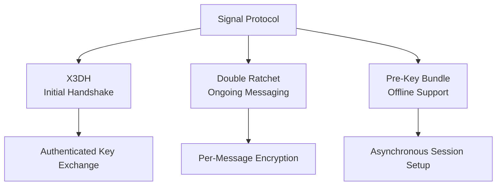
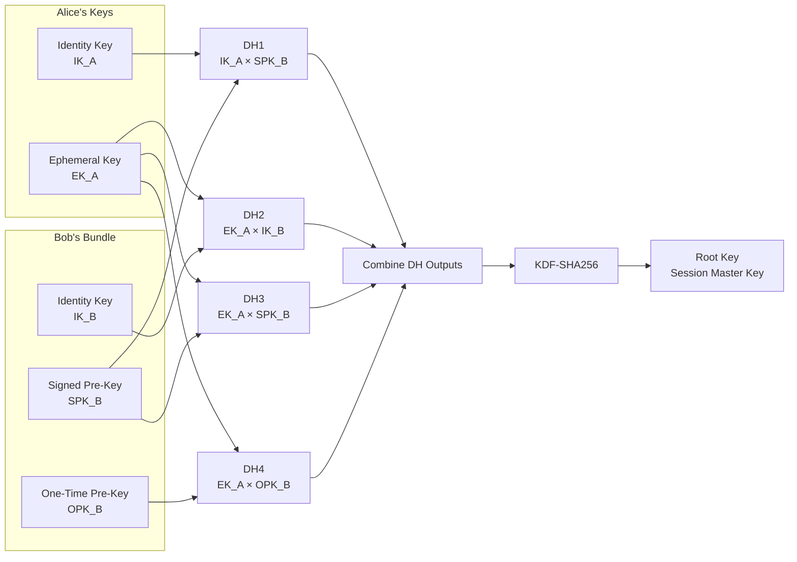
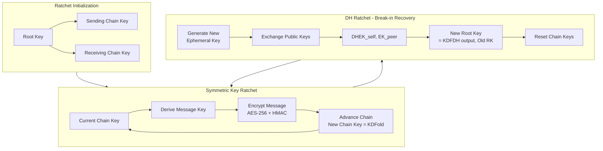
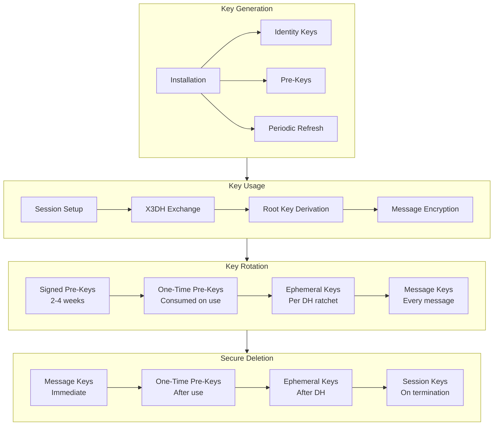
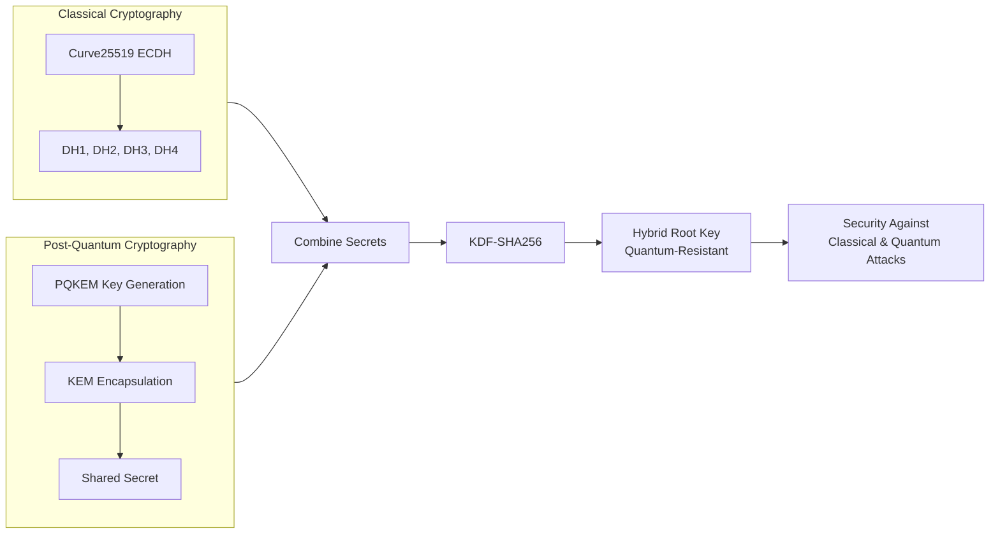

# 🔐 Signal Protocol
*End-to-End Encryption for Secure Messaging*

---

## 🏗 Protocol Architecture Overview

### Core Components
| Component | Purpose | Security Property |
|-----------|---------|-------------------|
| **X3DH** | Initial Key Agreement | Authenticated Key Exchange + Forward Secrecy |
| **Double Ratchet** | Ongoing Messaging | Per-Message Keys + Break-in Recovery |
| **Pre-Key Bundle** | Offline Capability | Asynchronous Session Setup |
| **PQKEM** | Post-Quantum Security | Quantum Attack Resistance |

---

## 🔑 Key Hierarchy & Types

### Long-Term Identity Keys
| Key Type | Purpose | Lifetime |
|----------|---------|----------|
| **Identity Key (IK)** | User Authentication | Permanent |
| **Signed Pre-Key (SPK)** | Session Bootstrap | Weeks/Months |
| **One-Time Pre-Keys (OPK)** | Forward Secrecy | Single Use |

### Ephemeral Session Keys
| Key Type | Purpose | Lifetime |
|----------|---------|----------|
| **Ephemeral Key (EK)** | Session Uniqueness | Per Session |
| **Root Key (RK)** | Master Session Key | Session Duration |
| **Chain Keys** | Message Key Derivation | Continuous Ratchet |
| **Message Keys** | Per-Message Encryption | Single Use |

---

## ⚙️ Protocol Execution Flow

### Phase 1: Pre-Registration (Bob - Recipient)
```plaintext
Step 1: Generate Cryptographic Identity
        ↓
        ├── Identity Key Pair (IK_B)
        ├── Signed Pre-Key (SPK_B) + Signature
        ├── One-Time Pre-Key Batch (OPK_B[1..N])
        └── Optional: PQKEM Key Pair
        ↓
Step 2: Upload Key Bundle to Server
        ↓
        └── Bundle: {IK_B, SPK_B, SPK_Sig, OPK_B[], PQKEM_pub}
```

### Phase 2: Session Initiation (Alice - Initiator)
```plaintext
Step 1: Fetch Bob's Bundle
        ↓
Step 2: Verify Cryptographic Identity
        │   ├── Validate SPK_B signature using IK_B
        │   └── Ensure bundle authenticity
        ↓
Step 3: Generate Session Keys
        │   ├── Ephemeral Key Pair (EK_A)
        │   └── Optional: PQKEM Key Pair
        ↓
Step 4: Perform X3DH Key Agreement
        │   Compute Four DH Operations:
        │   ├── DH1 = DH(IK_A, SPK_B)
        │   ├── DH2 = DH(EK_A, IK_B)  
        │   ├── DH3 = DH(EK_A, SPK_B)
        │   └── DH4 = DH(EK_A, OPK_B)
        ↓
Step 5: Derive Master Secret
        │   Root Key = KDF(DH1 || DH2 || DH3 || DH4 || PQ_secret)
        ↓
Step 6: Send Initial Message
        └── Contains: EK_A_pub, identifiers, encrypted data
```

### Phase 3: Session Acceptance (Bob - Recipient)
```plaintext
Step 1: Receive Alice's Initial Message
        ↓
Step 2: Retrieve Used One-Time Key
        │   ├── Locate OPK_B used by Alice
        │   └── Mark for deletion after use
        ↓
Step 3: Perform Mirror X3DH
        │   Compute Same DH Operations:
        │   ├── DH1 = DH(SPK_B, IK_A)
        │   ├── DH2 = DH(IK_B, EK_A)
        │   ├── DH3 = DH(SPK_B, EK_A)
        │   └── DH4 = DH(OPK_B, EK_A)
        ↓
Step 4: Derive Identical Root Key
        │   Root Key = KDF(DH1 || DH2 || DH3 || DH4 || PQ_secret)
        ↓
Step 5: Initialize Double Ratchet
        └── Begin secure messaging with derived keys
```

### Phase 4: Ongoing Messaging (Double Ratchet)
```plaintext
For Each Message:
1. Derive Message Key
   │   Message Key = KDF(Chain Key, "message")
   │
2. Encrypt & Authenticate
   │   Ciphertext = AES-256(Message Key, Plaintext)
   │   Auth Tag = HMAC-SHA256(Message Key, Ciphertext)
   │
3. Advance Chain
   └── New Chain Key = KDF(Chain Key, "ratchet")

Periodic DH Ratchet:
1. Generate New Ephemeral Key Pair
2. Perform DH Exchange
   │   New Root Key = KDF(DH(EK_new, EK_peer), Old Root Key)
   └── Reset Chain Keys for Forward Secrecy
```

---

## 🛡 Security Mechanisms

### X3DH Security Properties
| Property | Mechanism | Protection |
|----------|-----------|------------|
| **Authentication** | Identity Key Signatures | MITM Prevention |
| **Forward Secrecy** | One-Time Pre-Keys | Past Message Protection |
| **Offline Capability** | Pre-Key Bundles | Asynchronous Setup |
| **Replay Prevention** | OPK Consumption | One-Time Use |

### Double Ratchet Security Properties
| Property | Mechanism | Protection |
|----------|-----------|------------|
| **Per-Message Keys** | Chain Key Derivation | Message Isolation |
| **Break-in Recovery** | DH Ratchet Steps | Future Security |
| **Out-of-Order Handling** | Message Key Storage | Network Resilience |
| **Forward Secrecy** | Key Deletion | Compromise Containment |

---

## 🔄 Key Management Lifecycle

### Key Generation & Rotation
```plaintext
Identity Keys:        Generated once, replaced on reinstall
Signed Pre-Keys:      Rotated every 2-4 weeks
One-Time Pre-Keys:    Consumed on use, replenished periodically
Ephemeral Keys:       Generated per session/DH ratchet
Message Keys:         Derived per message, deleted after use
```

### Key Deletion Policy
```plaintext
Immediate Deletion:
✓ Message keys after encryption/decryption
✓ One-time pre-keys after consumption
✓ Ephemeral private keys after DH computation

Conditional Deletion:
✓ Chain keys after ratchet step
✓ Root key on session termination
```

---

## 🎯 Threat Model & Protections

### Protected Against:
- **Message Interception** → End-to-End Encryption
- **Historical Compromise** → Perfect Forward Secrecy
- **Future Compromise** → Break-in Recovery
- **Identity Spoofing** → Key Authentication
- **Replay Attacks** → One-Time Key Consumption
- **Quantum Attacks** → PQKEM Hybrid Mode

### Limitations:
- **Metadata Exposure** → Communication patterns visible
- **Device Compromise** → Runtime memory attacks
- **Physical Access** → Device-level attacks
- **Server Trust** → Key distribution reliance

---

## 📊 Cryptographic Primitives

### Algorithms Used
| Purpose | Algorithm | Parameters |
|---------|-----------|------------|
| Key Exchange | X25519 | Curve25519 ECDH |
| Signatures | Ed25519 | Curve25519 EdDSA |
| Encryption | AES-256 | CBC/GCM Mode |
| Authentication | HMAC-SHA256 | 256-bit MAC |
| Key Derivation | HKDF-SHA256 | Multiple Stages |
| Post-Quantum | Kyber/Saber | NIST PQC Standards |

---

## 🔧 Implementation Details

### Message Format
```plaintext
Signal Message Structure:
├── Header
│   ├── Version Information
│   ├── Sender/Receiver Identifiers
│   ├── Key Material (EK_pub, etc.)
│   └── Ratchet State Information
├── Payload
│   ├── Ciphertext (AES-256 encrypted)
│   └── Authentication Tag (HMAC-SHA256)
└── Optional Attachments
    └── Separately encrypted with unique keys
```

### Session State Management
```plaintext
Active Session Components:
├── Root Key (Current master secret)
├── Sending/Receiving Chain Keys
├── Pending Message Keys (out-of-order handling)
├── DH Ratchet State
└── Partner Key Information
```

---

## 🌐 Post-Quantum Extension (PQKEM)

### Hybrid Key Agreement
```plaintext
Classical + Quantum-Resistant:
Root Key = KDF(
    DH1 || DH2 || DH3 || DH4 ||    # Classical ECDH
    PQKEM_shared_secret            # Post-quantum KEM
)
```

### Security Benefits
- **Backward Compatibility** → Works with existing implementations
- **Quantum Resistance** → Protection against future quantum computers
- **Graceful Transition** → Incremental deployment capability

---

## 🔄 Signal Protocol Flowcharts

### Overall Protocol Architecture

### X3DH Key Agreement Detail


### Double Ratchet Mechanism


### Security Properties Flow

```mermaid
flowchart TD
    subgraph ForwardSecrecy [Perfect Forward Secrecy]
        FS1[One-Time Pre-Keys] --> FS2[Ephemeral Session Keys]
        FS2 --> FS3[Per-Message Keys]
        FS3 --> FS4[Keys Deleted After Use]
        FS4 --> FS5[Past Messages Secure]
    end

    subgraph BreakInRecovery [Break-in Recovery]
        BR1[Compromised Device] --> BR2[DH Ratchet Step]
        BR2 --> BR3[New Ephemeral Keys]
        BR3 --> BR4[New Root Key]
        BR4 --> BR5[Future Messages Secure]
    end

    subgraph Authentication [Strong Authentication]
        A1[Identity Keys] --> A2[Signed Pre-Keys]
        A2 --> A3[Signature Verification]
        A3 --> A4[MITM Prevention]
    end

    ForwardSecrecy --> Overall[End-to-End Security]
    BreakInRecovery --> Overall
    Authentication --> Overall
```


### Key Lifecycle Management


### Post-Quantum Extension


---

## ✅ Summary

The Signal Protocol provides comprehensive end-to-end encryption through:

1. **Secure Session Setup** - X3DH with authentication and forward secrecy
2. **Continuous Protection** - Double Ratchet for per-message security
3. **Robust Key Management** - Hierarchical keys with proper lifecycle
4. **Future-Proof Design** - Post-quantum ready architecture
5. **Practical Security** - Balance of strong crypto and usability
